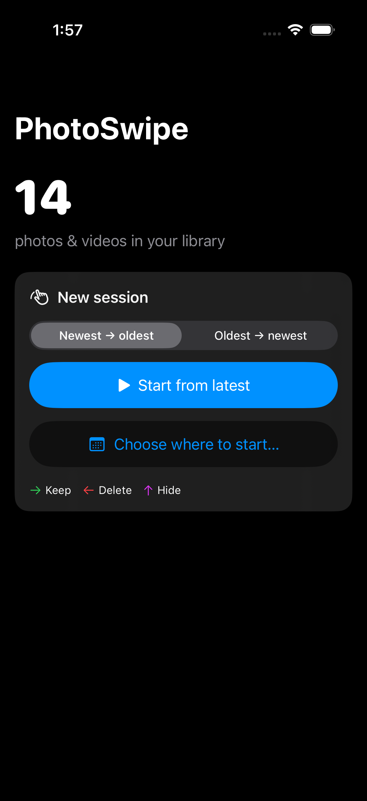
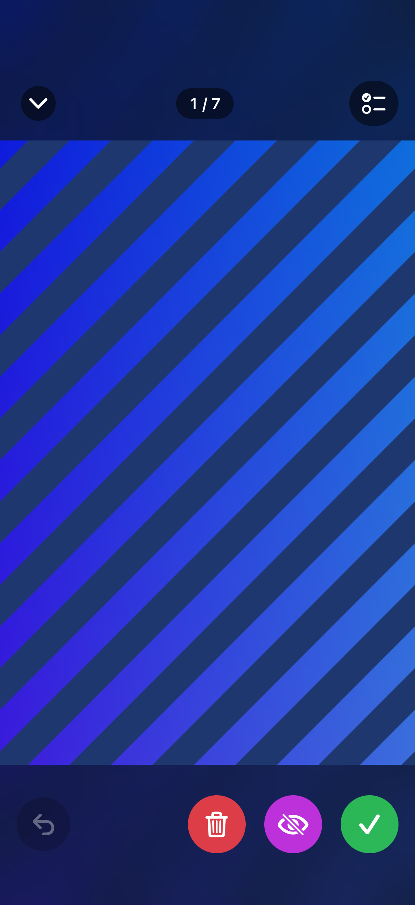
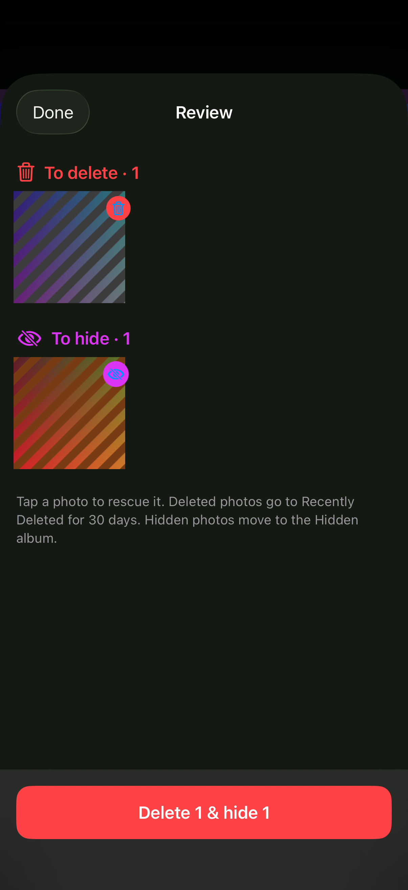

# PhotoSwipe

An iPhone and Mac app that does one thing well: rapid photo triage.

Enter **delete mode**, see one photo fullscreen at a time, and swipe:

| Gesture | Result |
|---|---|
| Swipe **right** | Keep |
| Swipe **left** | Queue for deletion |
| Swipe **up** | Queue for hiding (iOS's Face ID-locked Hidden album) |
| **Undo** button | Step back to the previous photo and decide again |

Nothing is destroyed while you swipe. When you're done, the **Review** screen shows
everything queued, lets you rescue anything with a tap, and commits all changes in one
batch. iOS asks you to confirm once for hides and once for deletes; deleted photos land
in Recently Deleted for 30 days.

Videos play inline on the card: they autoplay muted and loop, and swipes work over the
playing video. A transport strip under the card has play/pause, a scrubber with elapsed and
total time (drag pauses, release resumes), and the mute toggle.

Pinch or double-tap any card to zoom in and inspect detail; while zoomed, one-finger drags
pan instead of swiping, so red and green strips appear along the left and right edges: tap
the left strip to delete, the right to keep, without zooming out first. Double-tapping again
(or pinching back) resets. The card fills
the screen and letterboxed photos sit on a blurred, darkened copy of themselves, so the next
card in the stack never shows through.

Bursts are flattened: every frame of a burst is its own card (Photos normally shows only the
representative frame), with a "Burst 3/12" badge under the top bar and a star on the frames
Photos or you picked. Deleting a frame deletes just that frame.

Start from your newest photo by default, flip to oldest-first, or use **Choose where to
start…** to jump to any month or date. Sessions are saved after every swipe, so quitting
the app never loses your delete list; Home offers **Resume** on the next launch.

  

## macOS

The same app runs on the Mac against the system Photos library, with the keyboard as the
primary input: ← delete, ↑ hide, → keep, ⌘Z undo, space play/pause, M mute, double-click
(or trackpad pinch) to zoom, esc to close the deck, ⌘R for Review. Mouse and trackpad
swipes work too. Requires macOS 14.

```sh
xcodebuild -project PhotoSwipe.xcodeproj -scheme PhotoSwipeMac -destination 'platform=macOS' build
open ~/Library/Developer/Xcode/DerivedData/PhotoSwipe-*/Build/Products/Debug/PhotoSwipe.app
```

Releases are published on the GitHub Releases page by `scripts/release-mac.sh` (see
[Releasing the Mac app](#releasing-the-mac-app)).

## Requirements

- Xcode 26 (builds against iOS 17.0+ and macOS 14.0+)
- [XcodeGen](https://github.com/yonaskolb/XcodeGen) only if you change `project.yml`
  (`brew install xcodegen`, then `xcodegen generate`). The generated `.xcodeproj` is committed.

## Project layout

```
PhotoSwipe/            shared by both apps
  App/          PhotoSwipeApp (entry + RootView), AppModel (wires session ↔ PhotoKit ↔ disk),
                Platform (the UIKit/AppKit seam: image type, haptics, presentation shims)
  Models/       SwipeSession — pure, testable engine: cursor, direction, decision log, undo
                BurstInfo — groups burst frames and numbers them in capture order
  Services/     PhotoLibraryService (PhotoKit), AssetImageLoader, AssetVideoPlayer, SessionStore
  Views/        HomeView, StartPickerView, SwipeView (deck, swipe + pinch-zoom gestures),
                ReviewView, AssetMediaView (image or inline video), AssetImageView (with
                blurred backdrop), VideoControlsView (play/pause, scrubber, mute),
                PlayerLayerView, Theme
  Resources/    iOS asset catalog + Info.plist
PhotoSwipeMac/         Mac-only: asset catalog (icon), Info.plist, entitlements (sandbox, Photos,
                       network client for iCloud originals). No Mac-only Swift so far.
PhotoSwipeTests/     unit tests for SwipeSession, SessionStore and BurstInfo
PhotoSwipeUITests/   XCUITests that drive real swipes against the simulator library
```

Both app targets compile the same `PhotoSwipe/` sources; `project.yml` gives the Mac target
its own resources. Platform differences are confined to `Platform.swift` (`PlatformImage`,
`Image(platformImage:)`, `Haptics`, `.swipeCover`/`.hidesStatusBar`/`.inlineNavigationTitle`
no-op shims) plus `#if canImport(UIKit)` branches in `PlayerLayerView` and the iOS-only audio
session code in `AssetVideoPlayer`. On iOS the deck is a full-screen cover; on macOS `RootView`
swaps the window between Home and the deck, so closing the deck sets `model.isSwiping = false`
on both platforms rather than calling `dismiss`.

The deck keeps a sliding prefetch window warm: 20 assets ahead and 2 behind are decoded at
screen size (and pulled from iCloud) via `PHCachingImageManager`, and released as they leave
the window. The window size lives in `AppModel.prefetchAhead`. Cache hits only happen when
the request size and options match, so live requests and the cache share one options factory.

`SwipeSession` never imports Photos. `PhotoLibraryService` maps the library to an array of
`localIdentifier`s (newest first) and the session walks that array; `direction` decides
whether the cursor moves +1 or -1. Hidden assets are excluded from the fetch, so a photo
you hide never resurfaces in triage. The fetch sets `includeAllBurstAssets`, so burst frames
are ordinary entries in that array; `BurstInfo.index` computes each frame's position from
the newest-first order.

The one `AssetVideoPlayer` is owned by `AppModel`, not by the card, so the transport strip in
the deck's chrome can drive it and it survives pinch-zoom (which scales only the card). Cards
are recreated per asset and SwiftUI does not order the old card's `onDisappear` against the
new card's `onAppear`, so a card only stops the player if `loadedID` is still its own asset.

## Build & test

```sh
# Build
xcodebuild -project PhotoSwipe.xcodeproj -scheme PhotoSwipe \
  -destination 'platform=iOS Simulator,name=iPhone 17' build

# Unit tests (fast, no simulator library needed)
xcodebuild -project PhotoSwipe.xcodeproj -scheme PhotoSwipe \
  -destination 'platform=iOS Simulator,name=iPhone 17' -only-testing:PhotoSwipeTests test

# UI tests: real swipes, undo, review rescue, relaunch/resume, and one end-to-end
# commit that deletes 1 + hides 1 photo from the simulator library.
xcodebuild -project PhotoSwipe.xcodeproj -scheme PhotoSwipe \
  -destination 'platform=iOS Simulator,name=iPhone 17' -only-testing:PhotoSwipeUITests test
```

### Simulator notes

- The simulator ships with a handful of sample photos. To add more:
  `xcrun simctl addmedia booted path/to/*.png`
- `xcrun simctl privacy booted grant photos <bundle id>` does **not** grant PhotoKit
  read-write access on recent iOS simulators. The UI tests therefore tap the real
  "Allow Full Access" alert on first launch. To re-trigger it:
  `xcrun simctl privacy booted reset photos com.ryancwynar.PhotoSwipe`
- Seed a test clip for the video test: `ffmpeg -f lavfi -i testsrc2=size=720x1280:rate=30:duration=4 -f lavfi -i sine=frequency=440:duration=4 -c:v libx264 -pix_fmt yuv420p -c:a aac -shortest clip.mp4 && xcrun simctl addmedia booted clip.mp4`
- The commit test mutates the simulator library (that is the point). Re-seed with
  `addmedia` if it runs low.
- The simulator library has no bursts and `addmedia` cannot create one, so the burst badge
  and per-frame deletion can only be checked on a real device.

## Running on a device

Open `PhotoSwipe.xcodeproj`, pick your iPhone, run. Signing is automatic with team
`B89YM4B72X` (edit `project.yml` / the target's Signing tab for a different team).

## Releasing the Mac app

`scripts/release-mac.sh` bumps the version (shared `scripts/bump-version.sh`), builds a Release
`PhotoSwipeMac`, zips it, pushes the tag and creates a GitHub release with the zip attached.

```sh
scripts/release-mac.sh                       # ad-hoc signed unless a Developer ID cert exists
ASC_KEY_ID=2M8HBZGHA8 ASC_ISSUER_ID=7a62ff2d-f404-42b0-b11b-2a475a0c4ad3 scripts/release-mac.sh   # + notarize
```

**Signing.** Distribution outside the App Store needs a **Developer ID Application**
certificate; if one is in the login keychain the script signs with it, notarizes via
`notarytool` with the App Store Connect API key, and staples the ticket, so downloads open
with no warning. Without one the build is ad-hoc signed and the first launch needs
right-click → Open (or Privacy & Security → Open Anyway); the release notes explain this.

Only the team's **Account Holder** can create a Developer ID certificate, and the App Store
Connect API refuses it (403) even with an App Manager key, so it is a one-time manual step:
a private key and CSR are already at `~/.appstoreconnect/signing/developer_id_application.{key,csr}`.
Upload the CSR at developer.apple.com → Certificates → + → *Developer ID Application*,
download the `.cer`, then:

```sh
cd ~/.appstoreconnect/signing
openssl x509 -inform der -in developer_id_application.cer -out developer_id_application.pem
openssl pkcs12 -export -inkey developer_id_application.key -in developer_id_application.pem -out developer_id_application.p12
security import developer_id_application.p12 -k ~/Library/Keychains/login.keychain-db -T /usr/bin/codesign
```

The next `release-mac.sh` run picks it up automatically.

## Not in v1

Duplicate detection, per-album filtering, and richer iCloud "not downloaded" placeholders.

## TestFlight

`scripts/testflight.sh` archives a Release build and uploads it to App Store Connect:

```sh
ASC_KEY_ID=2M8HBZGHA8 ASC_ISSUER_ID=7a62ff2d-f404-42b0-b11b-2a475a0c4ad3 scripts/testflight.sh
```

Auth: an App Store Connect API key (Team key, App Manager role) read from
`~/.appstoreconnect/private_keys/AuthKey_<KEY_ID>.p8`; without `ASC_KEY_ID` the script falls
back to the Apple ID signed in to Xcode. `ITSAppUsesNonExemptEncryption` is false, so builds
skip the export-compliance prompt.

**Versioning.** Every run bumps the patch component of `MARKETING_VERSION` in `project.yml`
(1.0 → 1.0.1 → 1.0.2 …), regenerates the `.xcodeproj`, and commits + tags the bump
(`v1.0.1`) before archiving, so the version shown in TestFlight moves with each build. The
bump commit is not pushed; run `git push --follow-tags` afterwards. The working tree must be
clean (or set `ALLOW_DIRTY=1`). Set `VERSION=1.1` to jump the major/minor instead of bumping.
The build number (`CURRENT_PROJECT_VERSION`) is still a UTC timestamp so uploads never collide.

**Signing is manual for the upload step.** Xcode 26's automatic distribution signing asks
Apple for a cloud-managed certificate (`DISTRIBUTION_MANAGED`), which this team's portal
rejects with a 403. So the export uses a classic **Apple Distribution** certificate in the
login keychain plus the **"PhotoSwipe App Store"** provisioning profile, both created by hand
in Certificates, Identifiers & Profiles (CSR via `openssl req`, upload, download `.cer`,
build a `.p12` with the key, `security import`; then an App Store profile for the bundle ID,
downloaded into `~/Library/Developer/Xcode/UserData/Provisioning Profiles/`). Both expire
2027-09-06. `scripts/ExportOptions.plist` names them. The archive step still uses automatic
(development) signing, which works fine.

App Store Connect record: "PhotoSwipe: Keep or Delete" (app id 6809222601; "PhotoSwipe" and
"Photo Swipe" were taken). The name can be changed under App Information before release.
